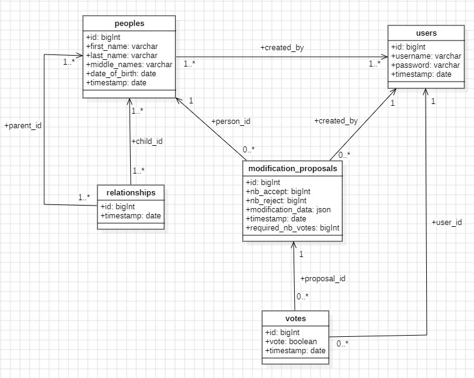

# Genealogie
Site de généalogie réaliser en Laravel/PHP

Auteur : **Alper Cakirgenc**

## Objectif

Le projet vise à créer un site de généalogie collaboratif dans lequel chaque utilisateur peut proposer des modifications ou ajouter des relations, qui ne seront effectives qu'après validation par la communautés.

---

## Schéma de base de données

Le schéma ci-dessous représente les tables nécessaires à la gestion des utilisateurs, des fiches personnes, des relations familiales, et du système de validation communautaire :

### Détail des tables

- **users**  
  Représente les utilisateurs inscrits sur le site.
  
- **peoples**  
  Représente les fiches personnes (entité dans l’arbre généalogique).
  Une colonne user_id (nullable) peut être ajoutée à peoples pour lier une fiche à un utilisateur.

- **relationships**  
  Stocke les liens de parenté entre personnes (ex : parent-enfant).
  
- **modification_proposals**  
  Permet de soumettre des propositions de modifications ou d’ajouts de relations.
  (ex : ajout d'un lien de parenté entre 2 personnes)
  Je tien à préciser que la colonne `required_nb_vote` est le nombre de vote requis pour pouvoir effectuer la modification ou non celon le résultats.

- **votes**  
  Permet aux utilisateurs de voter pour ou contre une proposition.
  Après un certain nombre de vote, suivant le résultats, c-à-d le nombre vote effectuée, si la majorité ont répondu pour la proposition, cette modification s'appliquera, dans le cas contaire ou la majorité on répondus contre la proposition, le changement ne s'effectueras pas.
---
## Étapes de l'évolution des données (Insertions, Updates)

### Cas 1 : Ajout de membres de la famille
1. **Création d'une fiche personne** dans la table `peoples`.  
   Exemple : l’utilisateur ajoute la fiche `Alice NINET`.

2. **Proposition d’ajout de relation** dans `modification_proposals` :  
   Exemple : lien de parenté entre `Bob NINET` (parent) et `Alice NINET` (enfant).

3. **Attente de votes communautaires** :  
   Les autres utilisateurs votent via la table `votes`.

4. **Traitement automatique après vote** :  
   - Si les votes "pour" sont majoritaires, **la relation est ajoutée** dans `relationships`.
   - Sinon, **la proposition est rejetée**.

### Cas 2 : Modification d’un membre de la famille

1. Un utilisateur propose une **modification de la fiche personne** (par exemple, corriger la date de naissance).

2. Une nouvelle entrée est créée dans `modification_proposals`, avec :
   - le `person_id` concerné,
   - les nouvelles données dans `modification_data` (format JSON),
   - `required_nb_votes` défini.

3. Les utilisateurs votent via la table `votes`.

4. Selon le résultat final :
   - Si accepté : les champs de la fiche `peoples` sont mis à jour.
   - Si refusé : aucune modification n’est faite.

---

## Exemple de flux complet

- `Rose03` propose d’ajouter une relation entre elle (`Rose NINET`) et son père `Bob NINET`.
- Le nombre de vote requis pour effectuer ou non la demande est de 3 (`required_nb_votes = 3`).
- Elle crée une proposition dans `modification_proposals`.
- `Bob01`et `Alice02` votent pour la proposition.
- `Marc10` vote contre la proposition.
- Le total de vote atteint le `required_nb_votes` avec une majorité qui est pour la proposition.
- La relation est automatiquement ajoutée dans `relationships`.
